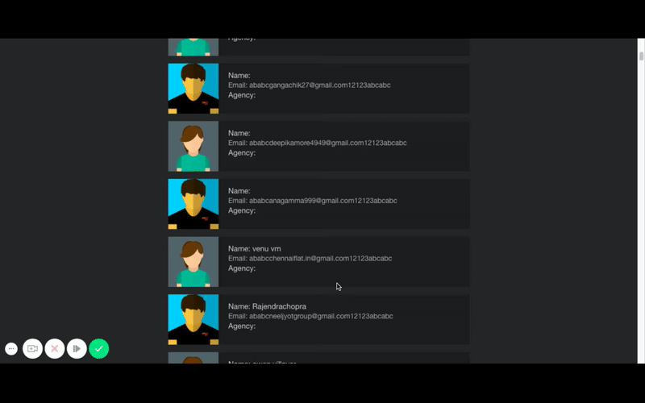
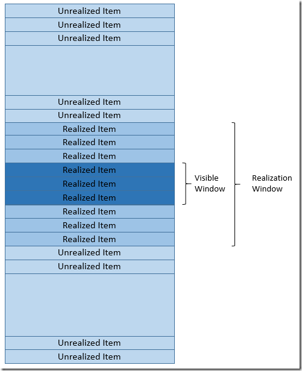

# react-windowed-contact-list
A React Contacts App using windowed list view using react-virtualized

## Quick Demo

## Usecases

1. Contacts to be taken from a dummy json data
2. Contacts to be read in chunks of 50(or 100) at a time (in other words, load more contacts data once user has reached near the 50 items, then load next 50, then when user reaches near 100 items, load another 50. This is more like a general News feed timeline like thing.
Search on the contacts data based on (name, email, agency)

## Assumptions and design decisions

1. There can be a lot of contacts, for example in this case, its  around 4k, but lets say we may even have more than that, so design should take this into consideration that loading that many data should be optimized.
2. When search is done on this large space of data, there can be a good amount of results, so we can show the results again in terms of infinite list or paginated. Taking the design consideration here and I have implemented it in the infinite list form, reason, all of the contacts app that we see, just filter out the results based on search and keep showing them in an infinite list form rather than a paginated form given the user experience. So here the results will be shown in the list form itself.
3. Now the reason to load contacts in bulk is to not choke the UI in rendering a lot of data at once.

## React

In react, there are couple of ways to implement lists:

### Naive Implementation:

* Load 50 items of contacts each time and keep adding it to some contacts state and keep rendering them each time we add more items to the contacts list.
* Now this will work perfectly fine to certain extent, lets say till 500/1000 elements, after that re-rendering each of those elements everytime will not be performant, even if the Virtual DOM will reconcile and will prevent the real DOM from  rendering unchanged items, still for the reconciliation process, the virtual DOM will need to re-render those items (1000, 2000, 3000, etc. whatever the number of contacts there be). And this will be the performance bottleneck.
* Now not only this, there is another gotcha. When you perform search on these large set of items, React will try to render the search items and once someone returns from the search, (or lets, say when someone goes from typing something on the search bar to empty search text again), it will need to render all of those 1000s of items again, this will make the UI thread block for a while too.

**NOTE :** But for small lists, this will work seamlessly. I have implemented this too as first implementation, **I have tagged that implementation in github with v1**, and then as a modification because the  search results were choking as per the above mentioned condition, I use the 2nd way as described below.

### Optimized Implementation (Using Windowed List view):

People familiar with **Mobile Development** will know that **iOS** and **Android** has their own native **ListView** implementation which lets them only render things which are in the viewport and keep recycling the ones which goes out of the viewport and load new elements in ListView as the data comes in. This keeps performance at par and good smooth scrolling performance and less memory footprint.

Now, consider the **news feed of twitter, facebook** etc, they need to keep infinite loading of feed items and if they keep adding items one by one and re render them every time, it will be a performance bottleneck, and thus they too use windowed list.

For this project, I have used [react-virtualized](https://github.com/bvaughn/react-virtualized) library, which is the most known and used windowed list library for React on the web. 

## Search

I have used client side search indexing of the data and indexed the contacts based on name, agency and email (the full email and also just the email provider too, meaning you can even search contacts with gmail.com, yahoo.com, etc).

As soon as the data is loaded in chunks, the set is added to the search index. This makes the search very fast. Also since the list is windowed, the search result issue that happens in the naive implementation does not happen in this case. So you can go from some search text in the search box to empty search in a total smooth way.

Also, the search remain fast even for list upto 10s of thousands of data, which I personally tested with.

So you can search based on:
1. Name,
2. Email
3. agency

I have used [js-worker-search](https://github.com/bvaughn/js-worker-search) library which creates the search index by tokenizing(but no stemming) and it also uses web-workers to speed up the process whenever it can.

## Code Structure:

I have followed **React Best Practices** and implemented the code in Components form, as modularized and reusable as possible. Each component also has its own style sheet again to keep individual component reusable and modularized. Used webpack for module packing.

#### Usage

    npm install
  
* For dev mode:

  		npm start
  
* For production mode:
  
      npm build

**NOTE:** Development mode will be slow because React Development built is a little verbose and does a  lot of checking (as per React Official Docs)

